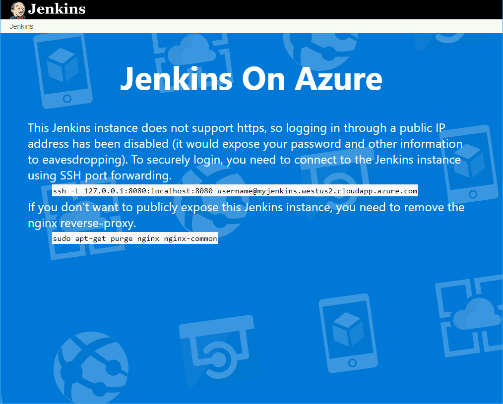
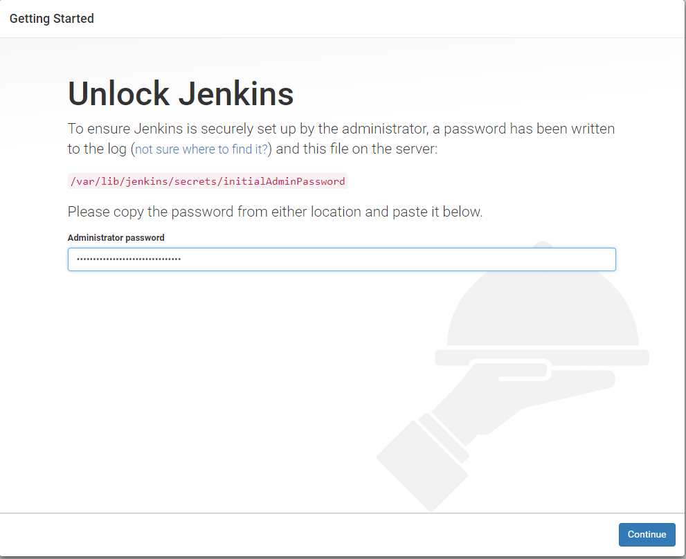
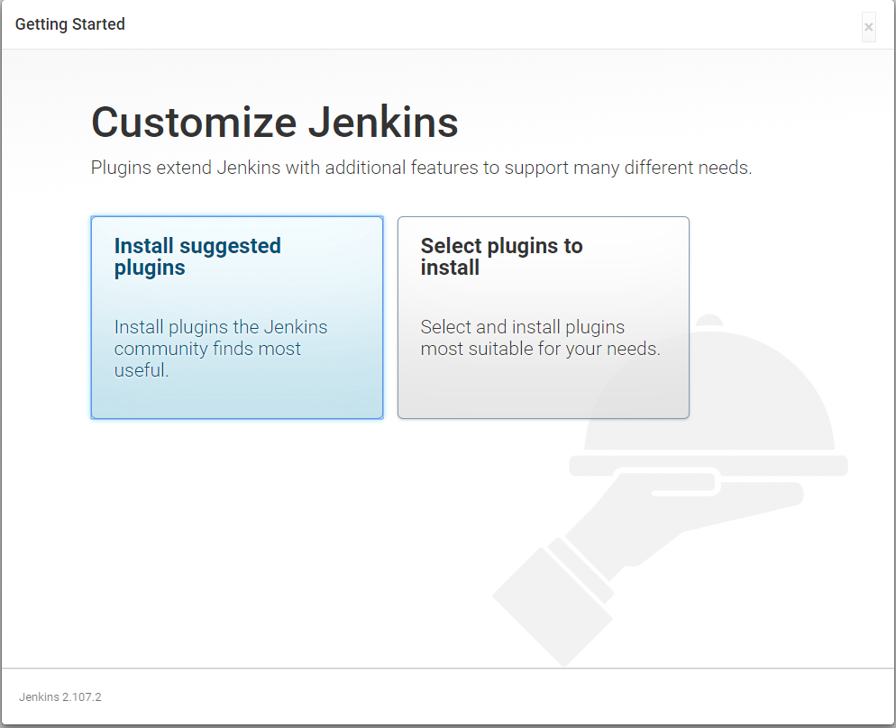
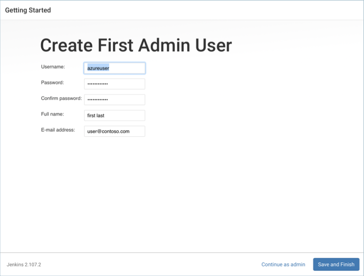
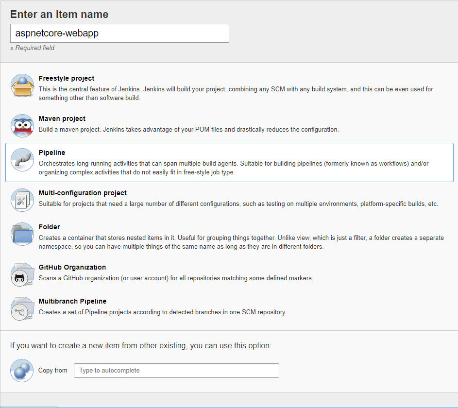
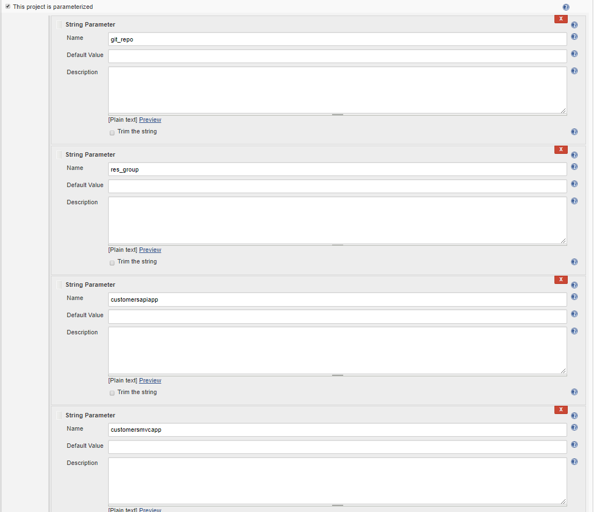
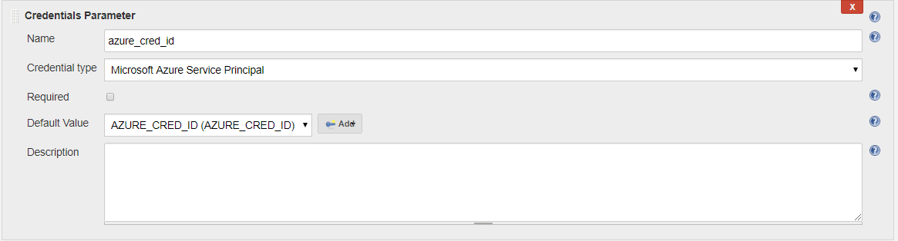
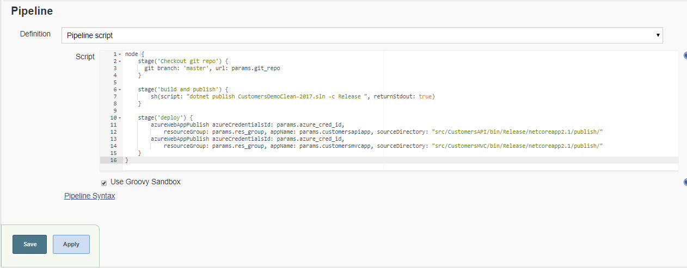
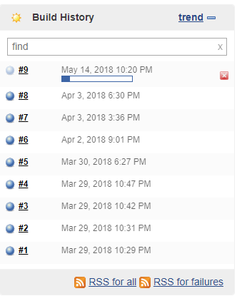
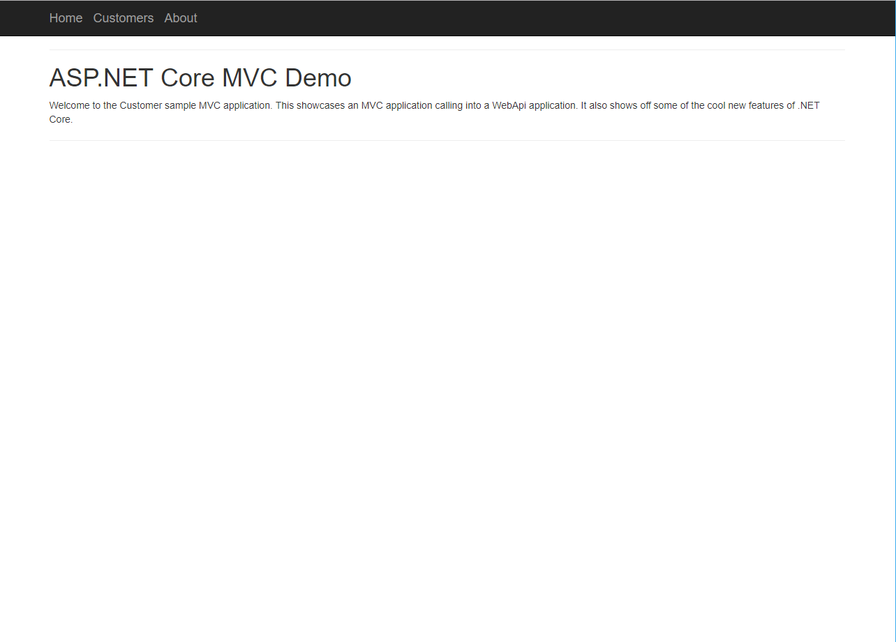

# CI/CD using Jenkins to deploy asp.net core application into Azure Web App

## Pre-configurations  

* Provision [Azure web app service](https://azure.microsoft.com/en-us/services/app-service/web/) for customersapi service.
* Provision [Azure web app service](https://azure.microsoft.com/en-us/services/app-service/web/) for customersmvc application.
* Provision [Azure Application Insights service](https://azure.microsoft.com/en-us/services/application-insights/).
* Configure application settings of customersapi web app. Set ApplicationInsights__InstrumentationKey to the instrumentation key of the Application Insights service.
* Configure application settings of customersmvc web app. Set ApplicationInsights__InstrumentationKey to the instrumentation key of the Application Insights service and CustomersAPIService__Url to the url of customersapi service.

## Deploy Jenkins server  

In the Azure portal, select **Create a resource** and search for **Jenkins**. Select the Jenkins offering with a publisher of **Microsoft** and select **Create**.  
Enter the following information on the basics form and click **OK** when done.  

* **Name** - name for the Jenkins deployment.  
* **User name** - this user name is used as the admin user for the Jenkins virtual machine.  
* **Authentication type** - SSH public key is recommended. If selected, copy in an SSH public key to be used when logging into the Jenkins virtual machine.  
* **Subscription** - select an Azure subscription.  
* **Resource group** - create a new or select an existing resource group.  
* **Location** - select a location for the Jenkins server.  

  
On the additional settings form, complete the following items:  

* **Size** - Select the appropriate sizing option for your Jenkins virtual machine.  
* **VM disk type** - Specify either HDD (hard-disk drive) or SSD (solid-state drive) for the Jenkins server.  
* **Virtual network** - (Optional) Select Virtual network to modify the default settings.  
* **Subnets** - Select Subnets, verify the information, and select **OK**.  
* **Public IP address** - Selecting the Public IP address allows you to give it a custom name, configure SKU, and assignment method.  
* **Domain name label** - Specify a value to create a fully qualified URL to the Jenkins virtual machine.  
* **Jenkins release type** - Select the desired release type from the options: LTS, Weekly build, or Azure Verified.  

  
For Integration Settings, select **No** to use Jenkins host to build the jobs.  
  
Once done with the integration settings, click **OK**, and then **OK** again on the validation summary. Click **Create** on the Terms of use summary. The Jenkins server takes a few minutes to deploy.  

## Configure Jenkins  

In the Azure portal, browse to the Jenkins Resource Group, select the Jenkins virtual machine, and take note of the DNS name.  
  
Browser to the DNS name of the Jenkins VM and copy the returned SSH string.  
  
Open up a terminal session on your development system, and paste in the SSH string from the last step. Update 'username' to the username specified when deploying the Jenkins server.  
Once connected, run the following command to retrieve the initial admin password.  

```bash
sudo cat /var/lib/jenkins/secrets/initialAdminPassword
```

[Install .net core 2.1](https://www.microsoft.com/net/download/linux-package-manager/ubuntu16-04/sdk-2.1.400)  

Leave the SSH session and tunnel running, and navigate to <http://localhost:8080> in a browser. Paste the initial admin password into the field as seen in the following image. Select **Continue** when done.  
  
Select **Install suggested plugins** to install all recommended Jenkins plugins.  
  
Create a new admin user account. This account is used for logging into and working with your Jenkins instance.  
  
Select **Save and Finish** when done, and then **Start using Jenkins** to complete the configuration.  
Jenkins is now configured and ready to build and deploy code. For this example, a simple asp.net core application is used to demonstrate a Jenkins build. It can be found at <https://github.com/mjrousos/AspNetCore-Sample>.  

## Create Azure service principal

* Go to **Credentials** -> **System** -> **Global credentials** -> **Add Credentials**
* In **Kind**, select **Microsoft Azure Service Principal** and input your [subscription information](https://docs.microsoft.com/en-us/azure/azure-resource-manager/resource-group-create-service-principal-portal).

## Create Pipeline build job and deploy to Azure web app  

Now create a Jenkins build job. Select **New Item**, give the build project a name such as aspnetcore-webapp, select **Pipeline**, and click **OK**.  
  
Define parameters "git_repo", "res_group", "customersapiapp", "customersmvcapp".
  
Define parameter "azure_cred_id", choose **Credential type** **Microsoft Azure Service Principal** and link it to the service principal credential you just created above.
  
Under **Pipeline**, set **Definition** to **Pipeline script** and input code

```bash
node {
    stage('Checkout git repo') {
      git branch: 'master', url: params.git_repo
    }
    stage('build and publish') {
        sh(script: "dotnet publish CustomersDemoClean-2017.sln -c Release ", returnStdout: true)
    }
    stage('deploy') {
        azureWebAppPublish azureCredentialsId: params.azure_cred_id,
            resourceGroup: params.res_group, appName: params.customersapiapp, sourceDirectory: "src/CustomersAPI/bin/Release/netcoreapp2.1/publish/"
        azureWebAppPublish azureCredentialsId: params.azure_cred_id,
            resourceGroup: params.res_group, appName: params.customersmvcapp, sourceDirectory: "src/CustomersMVC/bin/Release/netcoreapp2.1/publish/"
    }
}
```

  

## Run the build job  

To test the build job, manually start a build.  
Select Build Now to start a build job. It takes a few seconds for the job to start, when running, you should see status similar to the following images.  
  

## Here you go

  