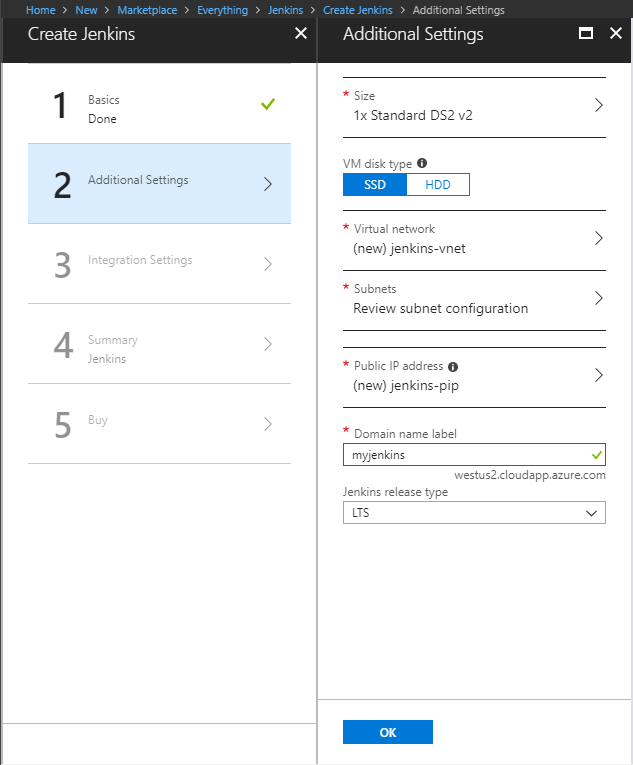
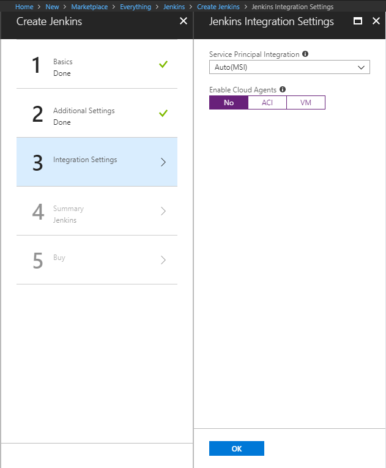

## Deploy Jenkins server  
In the Azure portal, select **Create a resource** and search for **Jenkins**. Select the Jenkins offering with a publisher of **Microsoft** and select **Create**.  
Enter the following information on the basics form and click **OK** when done.  
* **Name** - name for the Jenkins deployment.  
* **User name** - this user name is used as the admin user for the Jenkins virtual machine.  
* **Authentication type** - SSH public key is recommended. If selected, copy in an SSH public key to be used when logging into the Jenkins virtual machine.  
* **Subscription** - select an Azure subscription.  
* **Resource group** - create a new or select an existing resource group.  
* **Location** - select a location for the Jenkins server.  
  
On the additional settings form, complete the following items:  
* **Size** - Select the appropriate sizing option for your Jenkins virtual machine.  
* **VM disk type** - Specify either HDD (hard-disk drive) or SSD (solid-state drive) for the Jenkins server.  
* **Virtual network** - (Optional) Select Virtual network to modify the default settings.  
* **Subnets** - Select Subnets, verify the information, and select **OK**.  
* **Public IP address** - Selecting the Public IP address allows you to give it a custom name, configure SKU, and assignment method.  
* **Domain name label** - Specify a value to create a fully qualified URL to the Jenkins virtual machine.  
* **Jenkins release type** - Select the desired release type from the options: LTS, Weekly build, or Azure Verified.  
  
For Integration Settings, select **No** to use Jenkins host to build the jobs.  
  
Once done with the integration settings, click **OK**, and then **OK** again on the validation summary. Click **Create** on the Terms of use summary. The Jenkins server takes a few minutes to deploy.  
## Configure Jenkins  
In the Azure portal, browse to the Jenkins Resource Group, select the Jenkins virtual machine, and take note of the DNS name.  
